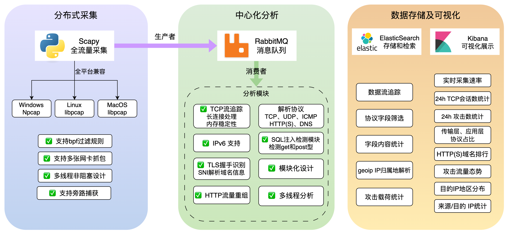

# ToyNetAnalyzer

> *玩具型*分布式网络抓包和安全分析系统，我在 UCAS《网络攻防基础》课程上的实验。用于在分布式环境中捕获和分析网络数据包，为网络安全和监控提供参考。

外表看起来花里胡哨，但实际用起来也算可用(?)🤣 在 OpenWrt 路由器上尝试部署了一下，除了内存占用比较大，运行还算稳定。代码 AI 含量较大，请仔细甄别。

## 主要功能
- **分布式架构**：采用多个采集端（agent）进行数据包收集，推给中央服务器进行分析。
- **协议分析**：支持对多种网络协议的分析，如 TCP、UDP、ICMP、HTTP、HTTPS 和 DNS 等。可提取源 IP、目的 IP、端口、数据包序列以及应用层数据等重要信息。
- **安全检测**：插件化的检测模块支持，内置示例的 SQL 注入检测模块。
- **SNI 检测**：支持对 HTTPS 流量基于 TLS 握手信息的 SNI 识别，从而识别用户访问的域名。
- **数据存储与可视化**：数据结构化后存储在 ElasticSearch 中，便于检索。利用 Kibana 创建了较为直观的仪表盘，用于监控网络流量趋势和统计信息。

## 技术实现
- **采集端实现**：采集端使用 Python 的 scapy 库构建，依赖 libpcap 或 npcap 进行数据包捕获。将捕获的数据包转换为 JSON 格式后发送到 RabbitMQ 消息队列。
- **服务器分析**：服务器端包含多个线程（可设置），作为  RabbitMQ 消费者接收的数据包。通过流表跟踪 TCP 会话以确保数据完整性。分析过程涉及在不同层（L2、L3、L4）解析数据包并提取相关信息，最后存储至 ElasticSearch。
- **ElasticSearch 映射**：在 ElasticSearch 中定义了多种映射，以高效存储数据包数据，包括 IP 信息、传输层详细信息、应用层数据和安全警报等字段。

## 安装与部署
1. **Elasticsearch 和 Kibana 搭建**：使用 docker-compose 在 docs/目录下的配置文件启动 Elasticsearch 和 Kibana，执行 `docker-compose up -d`。注意及时修改默认密码以保障安全。随后修改 `es_conn.py` 中相关配置。
2. **RabbitMQ 搭建**：执行 `docker run -d –name rabbitmq -p 5672:5672 -p 15672:15672 rabbitmq:management` 命令启动 RabbitMQ。
3. **采集端安装**：在 Windows 系统上需先安装 npcap。在类 Unix 系统中，安装 scapy 时通常会自动处理相关依赖。使用 `pip install scapy pika` 安装所需库，并配置 RabbitMQ 连接参数和要嗅探的网卡接口。
4. **服务器安装**：安装 `requirements.txt` 中的依赖项。修改 `es_conn.py` 中的 ElasticSearch 连接参数，并在 `main.py` 中配置如 TCP 会话超时等其他设置。

## 局限性
- **性能瓶颈**：在高流量场景下存在性能问题，有待进一步优化。
- **协议支持**：协议解析可进一步改进，以支持更多协议并使其结构更合理。
- **可视化**：目前的可视化受限于 Kibana 功能，可进行增强以实现更高级的分析。
